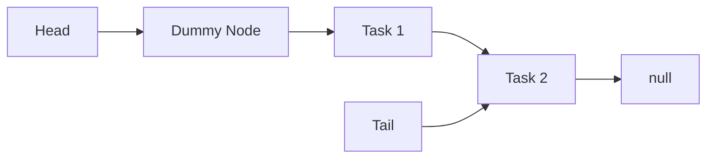

# Algorithms Explained (For Normal Humans)

This document explains the magic behind the **Lock-Free Thread Pool**. We use some fancy computer science terms, but don't worry—we'll explain them using real-world analogies.

---

## 1. What is "Lock-Free"?

Imagine a single bathroom with one key. Only one person can use it at a time. Everyone else has to wait in line. This is **Locking**. It's safe, but slow.

**Lock-Free** is like a buffet. Everyone grabs food at the same time. There are no locks, but you have to be polite and follow some rules so you don't bump into each other or grab the same spoon at the exact same moment.

### The Secret Weapon: Compare-And-Swap (CAS)

In C++, this is simplified as `compare_exchange`. Think of it like **booking a specific seat at a movie theater online**.

1. **Read (Look)**: You look at the map and see Seat A1 is green (available).
2. **Decide**: "I want Seat A1."
3. **CAS (Click "Buy")**: You try to pay for it.
    * **Success**: Nobody else bought it in the last 5 seconds. It's yours!
    * **Failure**: Someone else was faster and bought it while you were getting your credit card. The map refreshes, and now A1 is red. You have to pick a new seat and try again.

We use this logic for *everything* in this thread pool. We don't stop the world; we just try to update a value, and if someone beat us to it, we retry.

---

## 2. The Queue (Michael-Scott)

This is where we store the tasks (functions) that the threads need to run. It's a "Multiple-Producer Multiple-Consumer" (MPMC) queue, meaning lots of people can add tasks and lots of people can remove tasks at the same time.

It has two main pointers:

* **Head**: Where we take tasks from.

* **Tail**: Where we add new tasks.

### Adding a Task (Enqueue)

1. Create a new node with your task.
2. Look at the `Tail`.
3. Try to stick your new node onto the end of the `Tail`.
    * **Use CAS**: "Is the `next` pointer of the Tail still `null`? If so, point it to MY node."
4. If it works, swing the `Tail` pointer to point to your new node. You're done!

### Removing a Task (Dequeue)

1. Look at the `Head`.
2. Is there a node after the `Head`?
3. Try to move the `Head` forward one step.
    * **Use CAS**: "Is the `Head` still pointing to this node? If so, move it to the `next` node."
4. If it works, you take the value from that node and run it.

---

## 3. The "ABA" Problem (The Scariest Bug)

This is the classic nightmare of lock-free programming.

### The Analogy: The Recycled Box

1. **Thread 1** looks at a box labeled **"A"**. It's full of cookies. Thread 1 pauses to tie its shoe.
2. **Thread 2** comes in, eats the cookies, throws usage box **"A"** in the trash.
3. **Thread 3** comes in, recycles the trash, makes a NEW box, and coincidentally labels it **"A"** again. It puts broccoli in it.
4. **Thread 1** finishes tying its shoe. It looks back. It sees a box labeled **"A"**. It thinks, "Aha! This is the same box of cookies I saw earlier!" and eats... **BROCCOLI**. 🤮

In C++, this happens when a memory address is freed and then re-allocated. The address (pointer) looks the same, but the object is totally different. The CAS operation gets tricked because the value *looks* correct (it matches "A"), but reality has changed.

---

## 4. Hazard Pointers (The Solution)

How do we stop eating broccoli? We use **Hazard Pointers**.

### The Analogy: The Reservation Sign

Before **Thread 1** touches *anything* (even before it looks inside the box), it puts up a big neon sign that says:

> **"I AM LOOKING AT BOX 'A'. DO NOT THROW IT AWAY."**

This is the **Hazard Pointer**. It's a global list that everyone can see.

When **Thread 2** wants to throw away box "A", it **MUST** check the signs first.

* If it sees Thread 1's sign on "A", it **cannot** throw it away. It puts "A" in a "To Be Deleted Later" pile.

* Later, once Thread 1 is done and takes down its sign, Thread 2 converts the trash.

This guarantees that as long as you are looking at an object, it cannot be deleted or reused effectively preventing the ABA problem. No broccoli for you!
