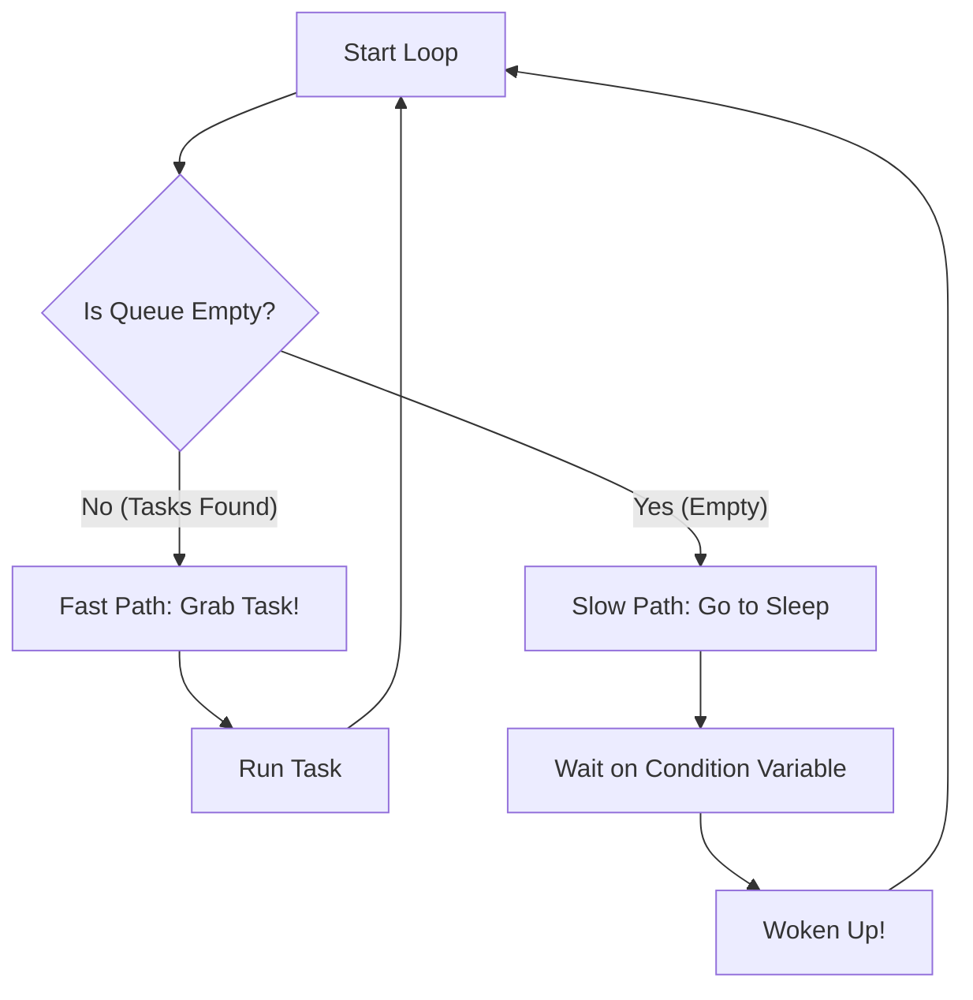

# Implementation Details (The Nuts and Bolts)

This document connects the high-level theories to the actual C++ code you see in `include/ms_jthread_pool.hpp`.

--

## 1. C++20 Cool Tools

We use modern C++20 features to make life easier.

### `std::jthread` (The Auto-Joiner)

In older C++, `std::thread` is like a leaky faucet. If you forget to turn it off (call `.join()`), your program crashes.
`std::jthread` is a "Joining Thread". When it goes out of scope, it **automatically** cleans itself up. It's safe by default.

### `std::stop_token` (The Polite Stop Button)

How do you kill a thread?

- **The Old Way**: `pthread_kill` (shooting it in the head). Dangerous.
- **The Bad Way**: A global boolean flag `bool running = true`. Messy.
- **The C++20 Way**: `std::stop_token`.

Is a standard way to say "Hey, please finish up what you're doing and exit." inside the thread loop, checking `st.stop_requested()`.

---

## 2. Memory Ordering (The Brainless Stuff)

This is the most confusing part of C++. We use `std::memory_order_...` everywhere. Here is the translation:

### `std::memory_order_relaxed`

**"The Post-it Note"**
I'm writing a note to myself. It doesn't matter if you see it now or in 5 minutes.
*Used for:* Incrementing counters, statistics.

### `std::memory_order_release` & `std::memory_order_acquire`

**"The Package Delivery"**

- **Release (Sending)**: I pack a box with data, tape it shut, and hand it to the driver. nothing I put *inside* the box can fall out.
- **Acquire (Receiving)**: You get the box and open it. You are guaranteed to see everything I put in there.

We use this for the Queue.

1. **Producer**: Writes the data, then uses `Release` to update the `Tail` pointer.
2. **Consumer**: Uses `Acquire` to read the `Head` pointer. This guarantees they see the data the producer wrote.

---

## 3. The Worker Loop (The Engine)

Each thread runs a loop that looks for work. It has two modes: **Fast Mode** and **Slow Mode**.



### The Fast Path (Lock-Free)

If there is work, we just grab it. No locks, no waiting. It's blazing fast ⚡️.

```cpp
// Fast path: loop while we can get tasks, without locking.
while (q_.try_dequeue(task)) {
  pending_task_count_.fetch_sub(1, std::memory_order_release);
  task();
}
```

### The Slow Path (Sleeping)

If the queue is empty, we don't want to spin in a circle burning CPU (making your laptop fan go crazy). So we go to sleep.
We use a `std::condition_variable` to wait. When a new task arrives, we wake up ONE thread.

---

## 4. Type Erasure (The Universal Box)

The queue stores `std::function<void()>`. This is a "Type Erased" container.
It means it can hold *any* function:

- A function pointer `void foo()`
- A lambda `[]{ std::cout << "Hi"; }`
- A method on a class object.

However, `std::function` needs the task to be **Copyable**.
`std::packaged_task` (which gives us the return value `future`) is **NOT Copyable**.

**The Hack:**
We wrap the task in a `std::shared_ptr`.

- The `shared_ptr` itself is copyable (it's just a small pointer).
- So `std::function` is happy copying the pointer.
- Both copies point to the same task. Success!
